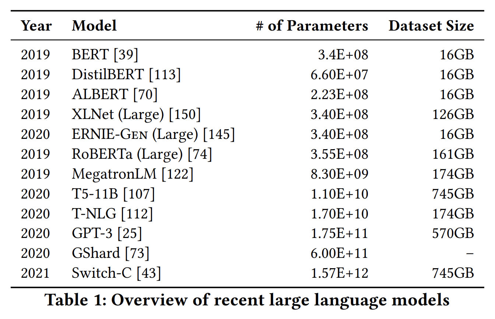
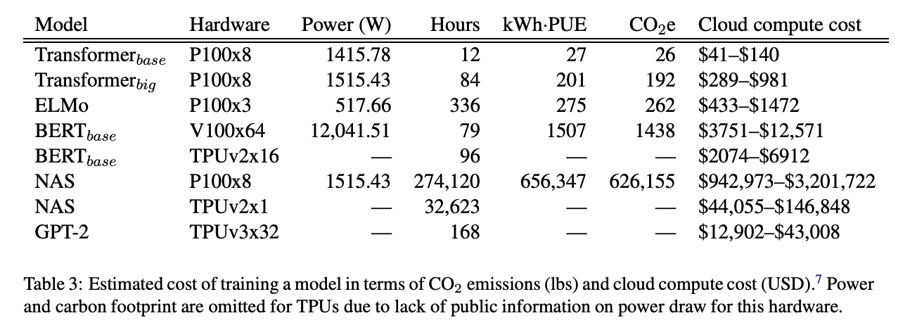

# Dangers Of Stochastic Parrots Presentation

Presentation of "On the Dangers of Stochastic Parrots: Can Language Models Be Too Big?" for DS-5899-01 at Vanderbilt University

## Introduction

Over the past 5 years, we have been experiencing huge advances in language models, and this trend seems to only be continuing. with brand new technologies such as GPT-4 coming out just this past week. The capabilities of these new models are impressive and with the rapid improvements in capabilities of these models, it is easy to see why experts are so eager to develop and improve these models so quickly. One of the driving factors in this rapid innovation is the increased avaliability and decreased cost of computational resources that allow models to grow larger than ever and be trained on more and more data. For the sake of this discussion, size of an LM is defined as a combination of the parameter count and the dataset training size.

This is represented in the following figure, showing the growth in both parameter count and training dataset size from 2019-2021.

The purpose of this paper is to highlight some of the concerns that come along with these large-scale language models, ranging from environmental concerns to the social and ethical isues that arise with LMs like these.

## Overview / Problem

Overall, I would break down the main arguments of the authors into three main concerns with large language models: environmental concerns, social bias and lack of interpretability.

#### Environmental Concerns

With the ongoing climate crisis, there has been a big push for companies to be more responsible with their emissions, particularly carbon dioxide emissions. It is estimated that a human will use 5 tons of carbon dioxide emissions (CO2e) per year in 2017. According to 'Energy and Policy Considerations for Deep Learning in NLP' by Strubell et al., a single training of a large transformer can take upwards of 280 tons CO2e. It is noted that hardly any of the energy sources that cloud computing services utilize are renewable. Listed below are a series of models that were examined for environemental costs in Strubell et al.'s paper:

The authors note how this high cost is not necessairly a bad thing as long as there is an improvement in accuracy. This was tested with the task of machine translation, a field where large language models had previously shown performance gains. It was estimated that in an English-to-German translation task, it costed 150,000 dollars and an unreported CO2e increase to raise the BLEU score (similarity between machine and human translation) by 0.1.

To bridge our discussion between environmental and social concerns, I want to bright to light another point that the author makes on how those communities who are generally most affected by climate change are generally those who will benefit from a large language model the least. As an example, people who live in the Maldives are estimated to have their home country completely submerged by 2100, however only around 60 percent of the residents have access to the internet. For those that do have internet access, it is unlikely that large language models are being developed for Dhivehi speakers, further reducing the percentage of individuals who would benefit from these technologies.

#### Social Concerns

When looking at social concerns, a lot of the discussion tends to revolve around bias involved in the training data. It has been shown in many studies in the past that problematic training sets can result in LMs that parrot derogatory sentiments along the lines of race, gender, ethnicity or disability status. There have been ongoing efforts such as Common Crawl, described as "petabytes of data collected over 8 years of web crawling", to create massive datasets that will accurately reflect the large and diverse online space. This is a step in the right direction, but with how it is being utilized, is still not perfect.

A filtered version of Common Crawl is part of the GPT-3 training set, but even with this, there is still a white-dominated viewpoint expressed in much of the data that is in US or UK English. Data from the Common Crawl that was used was selected for its similarity to GPT-2 training data, which is largely based on avaliable internet text data, such as Wikipedia articles or Reddit discussions, further pushing this issue since these are sites that are generally visited and maintaned by white males between the ages of 18-29.

This was not the only diversity concern in their filtering methods however; all documents were checked and thrown out if they contained a word on a giant corpus of foul language, including slurs, swears, pornographic terms and other hate speech. Authors note how certain included terms such as 'twink' may have been seen as a pornographic or derogatory in the past, but have been adopted by the LGBTQ+ community as non-derogatory terms. This results in a model that is less likely to have been exposed to material from online spaces designed for and occupied by LGBTQ+ people.

There can also be problems in how certain tokens are encoded and associated with each other. For instance, an example is given of how it is common for people with disabilities to be commonly associated with more negative sentiments, and for mental illness to be commonly associated with gun violence, homelessness and drug addiction. This is a direct effect of training texts that may link these ideas together even though they are not necessarily always seen in unison. As a result of this, we can see models that produce text with negative sentiments when discussing mental illness or disability when the prompt given had no negative connotation.

#### Interpretability Concerns

The final concern that the authors bring up is the lack of interpretability of most large-scale language models. This is in both the outputs and the inner workings of an LM. Firstly, it is easy for a user to see the output of an LM, particularly when it is about something that they are not as familiar with, and accepting it as the truth. As I am sure that everyone here is familiar with, LMs are not reliable 100% of the time.

This is not necessairly the fault of the creators however; this relies on the user being skeptical of responses and understanding that 'coherence is in the eye of the beholder'.

Another related point that is brought up by the authors is understanding exactly how LMs come to the conclusions that they do. We know the general idea of what models are doing, but we cannot visualize this easily. This creates a sort of 'black box' where words go in and come out, but we don't know what is going on inside. In a situation where an LM is creating problematic text, this makes it particularly difficult for developers to determine exactly where the model is going wrong. It is important to remember that these models are not trying to create communicative text, but rather to simply predict the next most likely token. This is why this paper refers to these models as 'stochastic parrots'.

## Authors' Suggestions

- Author suggests that researchers should report training time and sensitivity to hyperparameters when the released model is meant to be re-trained for downstream use to both inform the public but also to level expectations for other researchers.

- There should be more of an emphasis on publishing and understanding LMs; we want to manage hype around these models so that we are not promoting training of larger models for lofty tasks

- There is a suggestion that carbon efficiency and energy consumption should be used as evaluation metrics

- More careful selection of training data and consideration when filtering already existing datasets.

- There should be more effort going into understanding exactly how the next token is decided inside a model.

## Let's Talk GPT-4

The rollout of GPT-4 has only exacerbated this issue for several reasons: of course the increased size of this model, but also there has been a serious lack of transparency from OpenAI regarding GPT-4. There has been no official figure for the number of parameters or the size of the training dataset, only that we know the training data now contains images. It is important for us as the users to at least have an idea of the contents of the training set if we want to use GPT-4 effectively. You wouldn't ride in a self-driving car in a blizzard that had never seen snow before. This is setting a bad precedent for other large tech companies creating similar models.

This also raises the concern that perhaps not all of OpenAI's training set was even theirs to use. It has been speculated that there could be copyrighted materials in the training set, which could be another reason that OpenAI does not want to release details. This idea is supported by the fact that Github and OpenAI are currently under a class-action lawsuit over their partnership in Github Copilot development. Finally, given what we know about ChatGPT's training set and how OpenAI has acknowledged that the training data underrepresented some communities, it can be suspected that the same is the case with GPT-4.

**Question** - How should these companies handle the balance of protecting industry secrets and fairly reporting their resources used? Should the government step in?

## Critical Analysis

- I think that the authors did a good job of listing a lot of potential problems with language models, however there was not a whole lot of explanation about what they think could have done better. Of course the technology is not going to be perfect, but something like creating an acceptable training set is an incredibly difficult task and it is tough to cover every single scenario. I think this is applicable to all three of their main concerns.

- When discussing the environmental concerns, I think there was too much of an emphasis on the negative effects. The industrial revolution destroyed the environment but it is undeniable that the industrial revolution greatly improved the quality of life for so many people around the world.

- I think that there are plenty of new issues that are emerging that should be considered as well. For instance, the examples that we have talked about in class with image generation: sexualization of women and use of others' intellectual property for training.

- I will also note that this has been a heavily contentious paper for many of the reasons listed above - I think the general reception was that the paper brings up good points, but the lack of concrete suggestions for improvement make it difficult to act on this. One of the authors, Timnit Gebru, was fired from Google after the release of this paper, with the claim from Google that it "didn't meet [their] bar for publication".

- I think there could have been a bit more emphasis on the advances we have made in environmental costs. The paper mentions the decreased environmental cost between LMs utilizing tokenizers and n-gram models, but that is the extent of it.

## Discussion Questions

- Which of these do you find to be most important to consider when training a large LM?

## Related Articles

**Energy and Policy Considerations for Deep Learning in NLP** - https://arxiv.org/pdf/1906.02243.pdf

**OpenAI co-founder on company’s past approach to openly sharing research: ‘We were wrong’** - https://www.theverge.com/2023/3/15/23640180/openai-gpt-4-launch-closed-research-ilya-sutskever-interview

**GPT-4 Is a Giant Black Box and Its Training Data Remains a Mystery** - https://gizmodo.com/chatbot-gpt4-open-ai-ai-bing-microsoft-1850229989
In the sense of this paper, language models are defined by systems that are trained for string prediction tasks

**We read the paper that forced Timnit Gebru out of Google. Here’s what it says.** - https://www.technologyreview.com/2020/12/04/1013294/google-ai-ethics-research-paper-forced-out-timnit-gebru/

**‘A Brave New World of Software Piracy:’ Lawsuit Takes Aim at Scrapping Methods Underpinning Modern Artificial Intelligence** - https://gizmodo.com/ai-microsoft-dall-e-1849816871

Computational needs has gone down compared to some past methods such as n-gram models which use connected substrings, with technologies such as embedding being developed that significantly decrease the size of the data used

